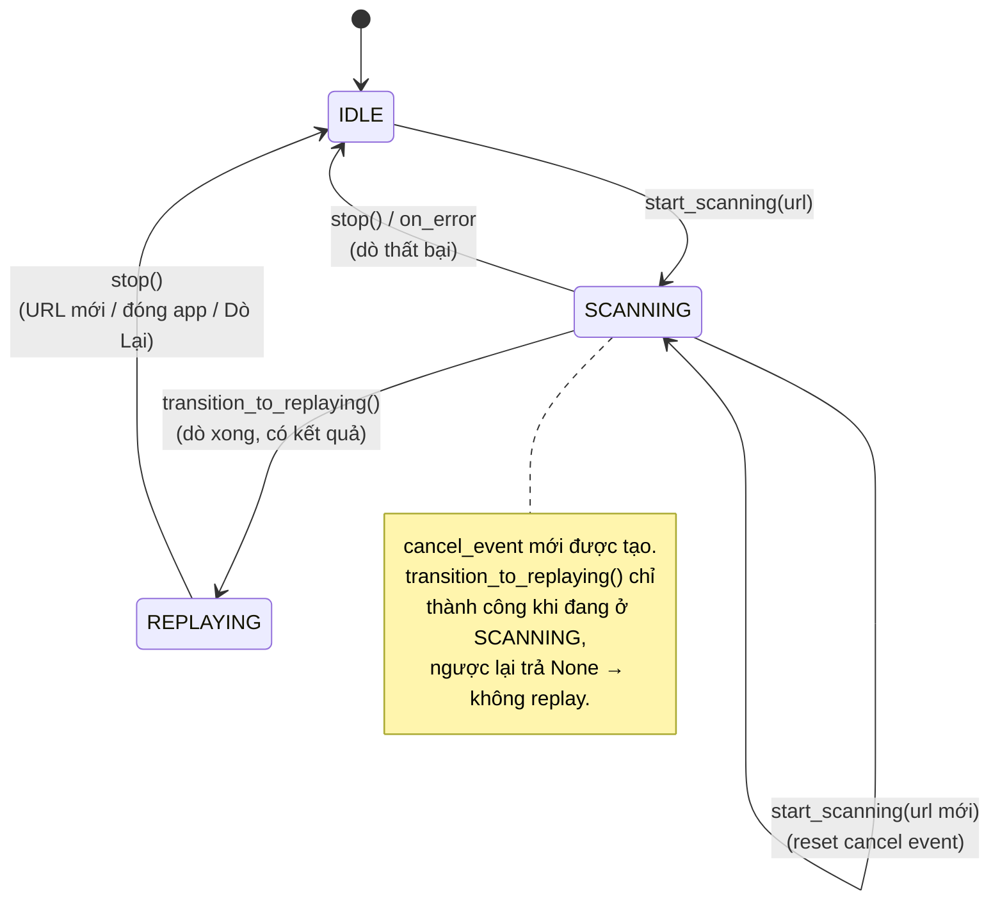
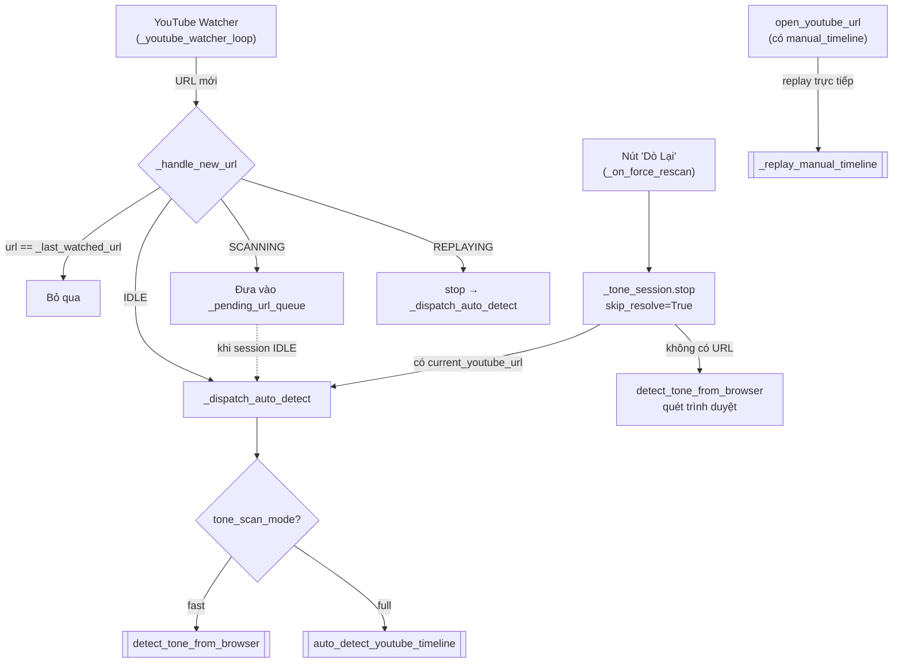
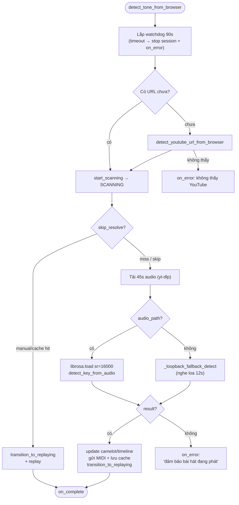
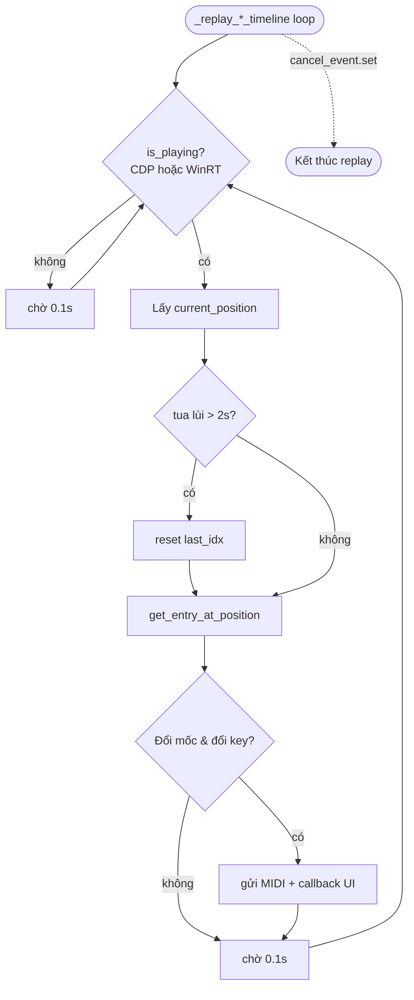

# Luồng hoạt động Dò Tone

Tài liệu mô tả các luồng dò tone, dò lại, các chế độ, và fallback trong app.
Nguồn: `core/engine/_tone.py`, `_youtube.py`, `_autokey.py`, `_session.py`, `frontend_qt.py`.

> **Lưu ý quan trọng về fallback nghe loa:** mọi luồng thu loopback giờ dùng
> chung `ToneDetector._find_loopback_device(pa)` — chọn loopback của **loa mặc
> định đang phát**, không lấy thiết bị đầu tiên trong danh sách. Trước đây lấy
> bừa cái đầu tiên gây ra triệu chứng "không có âm thanh" dù nhạc vẫn phát khi
> máy có nhiều ngõ ra (Speakers / Headset / HDMI).

---

## 1. State machine của `ToneSession`



---

## 1b. Tự động thử lại 3 lần + báo nguyên nhân (`_dispatch_auto_detect`)

Áp dụng cho **cả 2 chế độ** (fast & full). Khi 1 lần dò lỗi → tự động dò lại tối
đa `_AUTO_DETECT_MAX_ATTEMPTS = 3` lần, cách nhau `_AUTO_DETECT_RETRY_DELAY_SEC = 3`s.
Hết lượt mới hiển thị lỗi kèm **nguyên nhân cụ thể**.


Nguyên nhân (`msg`) lấy từ tầng dò: yt-dlp lỗi + loa im lặng / không tìm thấy loopback /
mở luồng thất bại / nghe được nhưng không ra tone… (xem mục 3).

---

## 2. Toàn cảnh các điểm vào (entry points)



---

## 3. Chuỗi resolve + fallback (dùng chung cho cả 2 chế độ)

```mermaid
flowchart TD
    START([Bắt đầu dò 1 URL]) --> SK{skip_resolve?}
    SK -->|true<br/>Dò Lại / force| YT
    SK -->|false| RES["_resolve_tone(url)"]

    RES --> C1{RAM cache phiên?}
    C1 -->|có| OUT_C[Trả cache → replay]
    C1 -->|không| C2{Manual timeline<br/>đã lưu?}
    C2 -->|có| OUT_M[Replay timeline thủ công]
    C2 -->|không| C3{Tone cache<br/>trên đĩa?}
    C3 -->|có| OUT_D[Replay cache]
    C3 -->|không| YT

    YT["Tải audio qua yt-dlp"] --> YTOK{Tải được?}
    YTOK -->|có| ANALYZE[Phân tích key bằng librosa]
    YTOK -->|"thất bại<br/>(chặn vùng / login / lỗi)"| LB

    LB["FALLBACK: nghe loa<br/>detect_key_from_system_audio<br/>chọn loopback loa MẶC ĐỊNH<br/>(reason_out ghi nguyên nhân)"] --> LBOK{RMS ≥ 0.001<br/>(có âm thanh)?}
    LBOK -->|có| ANALYZE
    LBOK -->|"không<br/>(im lặng / no device / lỗi)"| ERR["reason cụ thể<br/>→ đưa lên _dispatch_auto_detect<br/>(thử lại / báo lỗi rõ)"]

    ANALYZE --> SAVE[Lưu cache + gửi MIDI] --> REPLAY[transition_to_replaying]
    ERR --> STOP[_tone_session.stop → IDLE]
```

---

## 4. Chế độ NHANH — `detect_tone_from_browser`



---

## 5. Chế độ FULL — `auto_detect_youtube_timeline`

```mermaid
flowchart TD
    G0([auto_detect_youtube_timeline]) --> GWD[Lắp watchdog 300s]
    GWD --> GM{Manual timeline<br/>đã lưu? (nếu !skip_resolve)}
    GM -->|có| GREPLAY[Replay timeline thủ công] --> GDONE
    GM -->|không| GSS[start_scanning → SCANNING]

    GSS --> GINFO[Lấy title video] --> GDL["download_youtube_audio (toàn bài)"]
    GDL --> GDLOK{audio_path?}
    GDLOK -->|có| GSEG["librosa.load sr=22050<br/>detect_timeline_advanced<br/>(nhiều mốc 15s/đoạn)"]
    GDLOK -->|"không<br/>(yt-dlp lỗi)"| GLB["_loopback_fallback_detect<br/>→ CHỈ 1 tone (timeline 1 mốc)"]

    GSEG --> GTL{timeline_entries?}
    GLB --> GTL
    GTL -->|rỗng| GE[on_error: không phát hiện tone]
    GTL -->|có| GSAVE["Lưu ManualToneTimeline<br/>+ ToneCache"] --> GR[transition_to_replaying<br/>_replay_manual_timeline] --> GDONE([on_complete])

    GDONE --> GPEND{Có pending URL?}
    GPEND -->|có| GNEXT[_dispatch_auto_detect URL kế]
```

---

## 6. Replay đồng bộ theo vị trí phát (cache & manual)



---

## 7. Các luồng thu loopback realtime khác (AutoKey)

Hai luồng này thu loopback liên tục, **không** qua yt-dlp; nay cũng dùng
`ToneDetector._find_loopback_device`:

- `start_autokey` (`_autokey.py`) — dò key realtime, bỏ phiếu (voting) qua nhiều
  segment, cập nhật UI khi key đổi.
- `detect_tone_continuous` (`_autokey.py`) — dò liên tục theo `youtube_monitoring_active`,
  build timeline rồi lưu `ToneCache` khi kết thúc.

Cả hai dừng segment nếu `rms < 0.001` (im lặng) → báo "Đang lắng nghe...".
