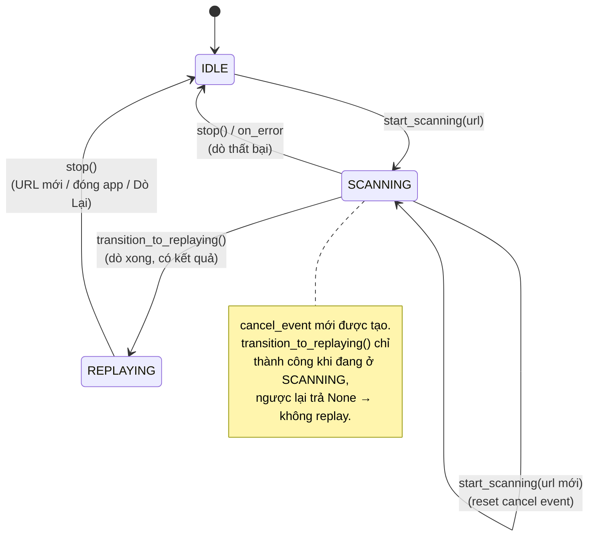
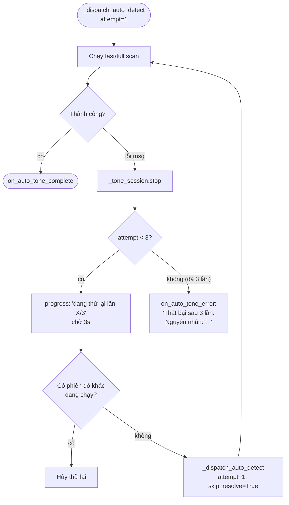
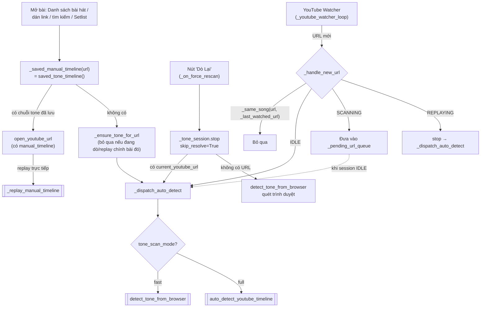
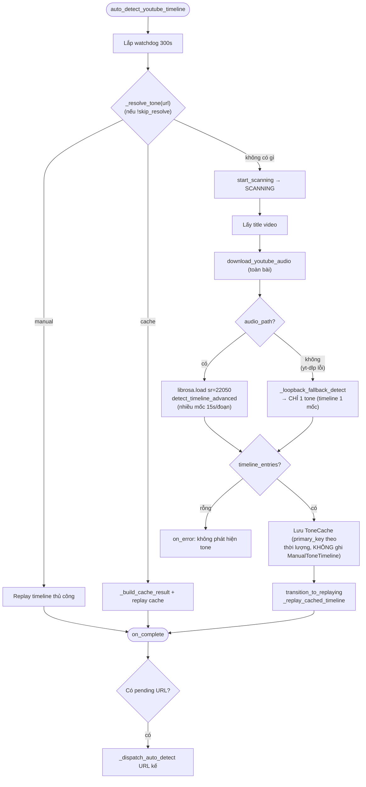
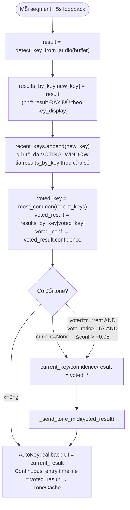
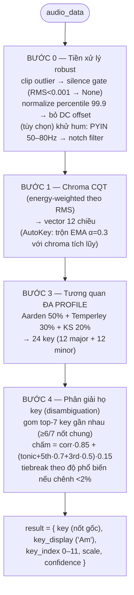

# Luồng hoạt động Dò Tone

Tài liệu mô tả các luồng dò tone, dò lại, các chế độ, và fallback trong app.
Nguồn: `core/engine/_tone.py`, `_youtube.py`, `_autokey.py`, `_session.py`, `frontend_qt.py`.

> **Lưu ý quan trọng về fallback nghe loa:** mọi luồng thu loopback giờ dùng
> chung `ToneDetector._find_loopback_device(pa)` — chọn loopback của **loa mặc
> định đang phát**, không lấy thiết bị đầu tiên trong danh sách. Trước đây lấy
> bừa cái đầu tiên gây ra triệu chứng "không có âm thanh" dù nhạc vẫn phát khi
> máy có nhiều ngõ ra (Speakers / Headset / HDMI).

> **⚠ Cập nhật (đợt sửa điểm mù tone):** Kết quả dò **TỰ ĐỘNG** giờ CHỈ ghi vào
> `ToneCache` (có TTL 30 ngày, tự dò lại được), **KHÔNG** còn ghi vào
> `ManualToneTimeline`. `ManualToneTimeline` nay chỉ chứa chỉnh sửa **thủ công**
> của người dùng (cờ `source="human"`). Nhờ vậy một lần dò sai không còn "khóa
> cứng" bài hát vĩnh viễn. Ưu tiên resolve: **manual (human) > cache**. Skip-resolve
> chỉ bị chặn khi có timeline thủ công thật (`get_timeline_source(url)=="human"`),
> không chặn vì cache.

> **⚠ Cập nhật 1.7.5 — "tone đã lưu không bị dò đè":** vá 4 chỗ khiến tone khách
> lưu vẫn bị dò lại:
> 1. **Tone của bài vào được chuỗi resolve.** `saved_songs.json → tone` (ô Tone lúc
>    "Lưu bài hát" / "Sửa thông tin") trước chỉ để HIỂN THỊ; nay là một mắt xích
>    thật (`core/tone_cache.py::song_tone_entry`), đứng **sau** `ToneCache` và
>    **trước** thư viện cộng đồng. Khách đổi tone ở 2 form đó còn được ghi luôn
>    thành chuỗi tone thủ công 1 mốc (`MainDashboard._save_single_tone_timeline`).
> 2. **Đệm resolve trong phiên tự hết hạn.** `core.tone_cache.data_version()` tăng
>    mỗi lần dữ liệu tone trên đĩa đổi; `_resolve_tone` so số này rồi bỏ đệm —
>    trước đây sửa chuỗi tone tay giữa phiên xong mở lại bài vẫn ra tone TỰ ĐỘNG
>    cũ còn nằm trong RAM. Đệm cũng khóa theo `song_match_key` (video_id) thay vì
>    chuỗi URL thô.
> 3. **Mọi đường mở bài dùng chung một nguồn.** Dán link / ô tìm kiếm
>    (`play_youtube_in_app`) trước đây xoá timeline rồi để engine dò lại; nay tra
>    `saved_tone_timeline(url)` và truyền `manual_timeline` như đường "Bài đã lưu".
> 4. **Chế độ FULL dùng chung chuỗi resolve** (trước chỉ xét timeline thủ công nên
>    có cache vẫn tải + phân tích lại cả bài), và **watcher so URL theo bài**
>    (`_same_song`, theo video_id) thay vì so chuỗi — link chia sẻ `youtu.be/…?si=`
>    không còn bị coi là "bài mới" để hủy replay.
> 5. **Đường mở bài tự chịu trách nhiệm gọi dò** (`_ensure_tone_for_url`). Trước
>    đây bài CHƯA có tone được dò *nhờ may*: app mở link chia sẻ, trình duyệt hiện
>    link chuẩn, watcher so chuỗi thấy khác nên tưởng "URL mới" rồi dò. Sửa (4)
>    làm cú dò tình cờ đó biến mất, nên `open_youtube_url` gọi thẳng — và bỏ qua
>    nếu phiên dò/replay của CHÍNH bài đó đang chạy.

---

## 1. State machine của `ToneSession`



---

## 1b. Tự động thử lại 3 lần + báo nguyên nhân (`_dispatch_auto_detect`)

Áp dụng cho **cả 2 chế độ** (fast & full). Khi 1 lần dò lỗi → tự động dò lại tối
đa `_AUTO_DETECT_MAX_ATTEMPTS = 3` lần, cách nhau `_AUTO_DETECT_RETRY_DELAY_SEC = 3`s.
Hết lượt mới hiển thị lỗi kèm **nguyên nhân cụ thể**.



Nguyên nhân (`msg`) lấy từ tầng dò: yt-dlp lỗi + loa im lặng / không tìm thấy loopback /
mở luồng thất bại / nghe được nhưng không ra tone… (xem mục 3).

---

## 2. Toàn cảnh các điểm vào (entry points)



---

## 3. Chuỗi resolve + fallback (dùng chung cho cả 2 chế độ)

```mermaid
flowchart TD
    START([Bắt đầu dò 1 URL]) --> SK{skip_resolve?}
    SK -->|true<br/>Dò Lại / force| YT
    SK -->|false| RES["_resolve_tone(url)"]

    RES --> C0{"Đệm phiên còn hạn?<br/>(data_version chưa đổi)"}
    C0 -->|"dữ liệu đã đổi"| CLR[Bỏ sạch đệm phiên] --> C2
    C0 -->|còn hạn| C1{RAM cache phiên?<br/>khóa = video_id}
    C1 -->|có| OUT_C[Trả cache → replay]
    C1 -->|không| C2{Manual timeline<br/>đã lưu?}
    C2 -->|có| OUT_M[Replay timeline thủ công]
    C2 -->|không| C3{Tone cache<br/>trên đĩa?}
    C3 -->|có| OUT_D[Replay cache]
    C3 -->|không| C4{"Tone của bài trong<br/>Danh sách bài hát?"}
    C4 -->|có| OUT_S[Replay tone đã lưu<br/>timeline 1 mốc]
    C4 -->|không| C5{Thư viện tone<br/>cộng đồng?}
    C5 -->|có| OUT_D
    C5 -->|không| YT

    YT["Tải audio qua yt-dlp"] --> YTOK{Tải được?}
    YTOK -->|có| ANALYZE[Phân tích key bằng librosa]
    YTOK -->|"thất bại<br/>(chặn vùng / login / lỗi)"| LB

    LB["FALLBACK: nghe loa<br/>detect_key_from_system_audio<br/>chọn loopback loa MẶC ĐỊNH<br/>(reason_out ghi nguyên nhân)"] --> LBOK{RMS ≥ 0.001<br/>(có âm thanh)?}
    LBOK -->|có| ANALYZE
    LBOK -->|"không<br/>(im lặng / no device / lỗi)"| ERR["reason cụ thể<br/>→ đưa lên _dispatch_auto_detect<br/>(thử lại / báo lỗi rõ)"]

    ANALYZE --> SAVE[Lưu cache + gửi MIDI] --> REPLAY[transition_to_replaying]
    ERR --> STOP[_tone_session.stop → IDLE]
```

---

## 4. Chế độ NHANH — `detect_tone_from_browser`


---

## 5. Chế độ FULL — `auto_detect_youtube_timeline`



---

## 6. Replay đồng bộ theo vị trí phát (cache & manual)


---

## 7. Các luồng thu loopback realtime (AutoKey & Continuous)

Hai luồng này thu loopback liên tục, **không** qua yt-dlp; nay cũng dùng
`ToneDetector._find_loopback_device`:

- `start_autokey` (`_autokey.py`) — dò key realtime, bỏ phiếu (voting) qua nhiều
  segment, cập nhật UI khi key đổi.
- `detect_tone_continuous` (`_autokey.py`) — dò liên tục theo `youtube_monitoring_active`,
  build timeline rồi lưu `ToneCache` khi kết thúc.

Cả hai dừng segment nếu `rms < 0.001` (im lặng) → báo "Đang lắng nghe...".

### 7a. Vòng bỏ phiếu (voting) — `VOTING_WINDOW = 3`



### 7b. ⭐ Bất biến nhất quán (consistency invariant)

> Trong mọi luồng, **key hiển thị = key gửi MIDI = key lưu cache** đều phải là
> CÙNG một key. Cụ thể `key_display`, `key_index`, `scale` luôn lấy từ **cùng một
> `result` dict**.

Cạm bẫy đã sửa: voting làm mượt `key_display` (chọn `voted_key`), nhưng MIDI/cache
lại lấy `key_index`/`scale` từ `result` của **frame mới nhất**. Khi frame mới nhất
khác key được bầu (đúng lúc voting phát huy tác dụng) → gửi sai tone sang Studio One.

```text
recent_keys = ['C','C','Am']   (frame mới nhất = 'Am', voted = 'C')

TRƯỚC:  hiển thị 'C'  ──  _send_tone_midi(result='Am')        ✗ LỆCH
SAU:    hiển thị 'C'  ──  _send_tone_midi(voted_result='C')   ✓ KHỚP
```

Cách sửa: giữ map `results_by_key: key_display → result`, rồi tra
`voted_result = results_by_key[voted_key]` để dùng cho cả MIDI, UI callback và
entry timeline. Áp dụng tại 3 chỗ:

| Vị trí | Trước | Sau |
|--------|-------|-----|
| `start_autokey` (voting) | MIDI/UI theo frame mới nhất | theo `current_result` (khớp `voted_key`) |
| `detect_tone_continuous` | entry/MIDI/callback theo frame mới nhất | theo `voted_result` |
| `_build_cache_result` (`_tone.py`) | hiển thị `primary_key` nhưng index/scale theo `timeline[-1]` | tìm entry **khớp `primary_key`** |

> Dữ liệu cache cũ lưu trước khi sửa có thể vẫn lệch — sẽ tự đúng lại khi dò tone mới.

---

## 8. Lõi nhận diện 1 đoạn — `ToneDetector.detect_key_from_audio`

Dùng chung cho TẤT CẢ các luồng ở trên (single-shot, timeline, voting).



> `key` = **nốt gốc** dùng cho `KEY_MIDI_MAP` (CC#33); `key_display` = tên đầy đủ
> cho UI ('Am'). `detect_timeline_advanced` (chế độ FULL) tái dùng BƯỚC 3–4 trên
> từng đoạn, thêm: novelty curve → find_peaks → refine ±3s → merge → lọc đoạn <8s.
